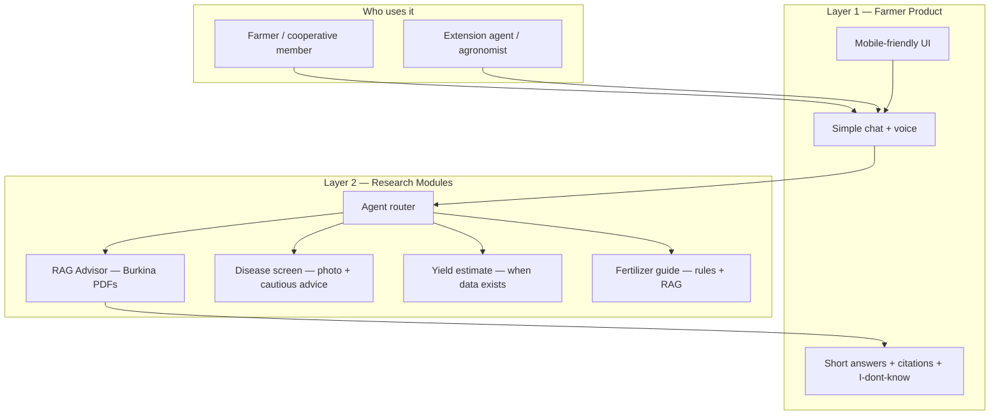

# DakiKobo Roadmap — Useful Product + PhD Portfolio

**Two goals, one project:**

1. **Useful** — Give real farmers (or extension agents working with them) practical, trustworthy advice for Sahel cereals.
2. **Credible** — Show UM6P / CROPRADAR reviewers you can build rigorous multimodal AI, not just a chatbot demo.

These goals overlap more than they conflict — but only if you build in the right order.

**PhD deadline:** July 15, 2026  
**Tools:** Cursor Pro · Colab Pro · Existing DakiKobo repo

---

## North Star (read this when you procrastinate)

> A farmer in Burkina Faso — or an extension agent sitting with them — can ask a question in simple French, get a short practical answer grounded in local documents, hear it read aloud, and (when possible) photograph a sick plant to get a cautious, actionable next step.

If a feature does not move that sentence forward, deprioritize it.

---

## Be Honest About the User

DakiKobo will not be used like ChatGPT on a laptop in an office. Design for reality:

| Constraint | What it means for DakiKobo |
|---|---|
| **Low literacy** | Voice output (TTS) is not a nice-to-have — it is core |
| **French + local languages** | French first; Mooré/Dioula later via translation layer |
| **Patchy internet** | Short answers, low data usage; offline path is a long-term goal |
| **Basic smartphones** | Simple UI, large buttons, image upload must work on mobile browser |
| **Trust gap** | Farmers trust neighbors and extension agents more than AI — cite sources, say "I don't know" |
| **Wrong advice is costly** | A bad fertilizer tip or false disease ID can ruin a season — always add uncertainty + "consult your agronomist" |

**Realistic primary user (for now):** not every farmer directly — start with **you, agronomy students, extension workers, and farmer cooperatives** who can validate answers before field rollout.

---

## What Farmers Actually Need vs. What Sounds Good on a PhD App

| Farmer need (high utility) | PhD buzzword version | Realistic approach |
|---|---|---|
| "When should I plant millet given the rains?" | Yield prediction | Start with **RAG + seasonal calendars** from your PDFs — more useful than a fake ML model on foreign data |
| "My maize leaves have spots — what is it?" | Disease diagnostics | **Photo + cautious guidance** ("possible X, confirm with agent") — not overconfident CNN labels |
| "How much urea for sorghum at tillering?" | Fertilizer recommendation | **Simple rules + RAG citations** from FAO/manuals — not a black-box regressor |
| "What variety works in my zone?" | Structured agronomic data | **Region-tagged knowledge base** — tag PDFs by zone (Sahel / Sudanian) |
| "I can't read well" | Multimodal AI | **French TTS + short answers** — you already have this, improve it |

**Key insight:** The PhD wants multimodal AI. Farmers want **short, safe, local answers**. Build both by making research modules **support** the advisor, not replace it.

---

## Two Layers — Don't Mix Them Up

### Layer 1: Farmer Product (usefulness first)

What must work well before July 15:

- Reliable text Q&A grounded in Burkina PDFs
- Answers under 100 words, practical tone, farmer language
- French TTS for every answer
- Source citation or "source: FAO / CSA plan" when possible
- Clear "I don't know" when context is missing
- Mobile-friendly chat UI
- All PDFs ingested and searchable

### Layer 2: Research Modules (PhD credibility)

What proves you can do multimodal precision ag research:

- Image-based disease screening (with confidence + disclaimer)
- Yield estimation from field variables (honest about data limits)
- Fertilizer reasoning that combines rules + RAG
- Agent router that picks the right module
- Colab notebooks with metrics (accuracy, RMSE, etc.)

**Rule:** Layer 1 ships first. Layer 2 wraps around it. Never ship Layer 2 at the expense of Layer 1 quality.

---

## Realistic Target Architecture

---

## Feature Priority Matrix

Build in this order. Each row is more useful to real users *and* strengthens the PhD story.

| Priority | Feature | Useful because… | PhD value | Effort |
|---|---|---|---|---|
| **P0** | Fix app, ingest all PDFs, persistent vector store | Answers actually draw on local knowledge | Shows data engineering rigor | Low |
| **P0** | Better RAG answers (citations, zone-aware, short) | Farmers get trustworthy advice today | LLM + retrieval research | Low |
| **P0** | French TTS + mobile UI polish | Accessibility for low-literacy users | Multimodal (text + audio) | Low |
| **P1** | Image upload → disease screening | Spot checks in the field | Computer vision | Medium |
| **P1** | Agent router (4 tools) | One interface for many tasks | Agentic / multimodal AI | Medium |
| **P2** | Fertilizer guide (crop + stage + soil) | Direct economic impact | Structured reasoning + LLM | Medium |
| **P2** | Colab disease notebook + metrics | Validates vision approach | Core PhD competency | Medium (Colab) |
| **P3** | Yield estimator | Useful only with **local or honest proxy data** | Core PhD competency | High |
| **P4** | Mooré / Dioula | Reach more farmers | Multilingual AI | High (post-deadline) |
| **P4** | Offline / OPAL | Rural connectivity reality | Edge AI research | High (post-deadline) |

---

## What "Useful" Means — Quality Bar

Before calling a feature done, it must pass these checks:

### For text answers (RAG)
- [ ] Answer is under 100 words
- [ ] Written for a farmer, not a researcher
- [ ] Grounded in retrieved context (not hallucinated)
- [ ] Says "I don't know" when context is insufficient
- [ ] Mentions crop + zone when relevant (Sahel / Sudanian)

### For disease screening
- [ ] Shows confidence level (high / medium / low)
- [ ] Gives 2–3 practical next steps (isolate plant, contact extension, don't spray blindly)
- [ ] Never claims 100% certainty
- [ ] Works on a phone camera photo (not just dataset images)

### For fertilizer advice
- [ ] States crop and growth stage used in the recommendation
- [ ] Gives ranges, not false precision ("about 30–40 kg N/ha" not "37.2 kg")
- [ ] Cites source document when possible
- [ ] Warns when soil test data is missing

### For yield estimates
- [ ] Shows that it is an **estimate**, not a guarantee
- [ ] Explains which inputs drove the result
- [ ] Honest about data: "based on similar seasons in [region]" — not pretending you have field sensors

---

## Revised 3-Week Plan (useful + credible)

### Week 1 — Make the core product trustworthy

**Farmer outcome:** Someone can ask about millet, sorghum, niébé, or groundnuts and get a useful spoken answer.

| Task | Farmer value | PhD value |
|---|---|---|
| Fix broken UI, mobile layout | Usable on phone | Professional demo |
| Ingest all remaining PDFs | Richer local knowledge | Data pipeline |
| Persistent ChromaDB (no re-index every restart) | Faster, more reliable | Engineering |
| Improve prompt: short, cited, zone-aware | Trustworthy advice | RAG research |
| Test 10 real farmer questions manually | Validate usefulness | Evaluation methodology |

**Done when:** 10/10 test questions get practical answers you would show to an extension agent.

---

### Week 2 — Add field tools (research-backed, farmer-safe)

**Farmer outcome:** Agent can photograph a sick plant and get cautious guidance + still ask text questions.

| Task | Farmer value | PhD value |
|---|---|---|
| Image upload in chat (mobile) | Field use | Multimodal input |
| Disease screening (Gemini Vision → later your CNN) | Early warning | Computer vision |
| Colab: PlantVillage fine-tune (maize, sorghum) | Better local model over time | Metrics + notebook |
| Agent router with `rag_advisor` + `diagnose_image` | One app, many tasks | Agentic AI |

**Done when:** Photo of diseased leaf → labeled response with confidence + next steps + disclaimer.

---

### Week 3 — Complete the research story + apply

**Farmer outcome:** Fertilizer questions get structured, sourced answers.

| Task | Farmer value | PhD value |
|---|---|---|
| `recommend_fertilizer` tool (rules + RAG) | Economic decisions | Structured + LLM reasoning |
| Yield estimator (simple model, honest limits) | Planning aid | Prediction research |
| 2-min demo video with real scenarios | Onboarding | Application material |
| Research statement + README with results | — | Application package |
| Submit PhD application | — | Deadline met |

**Done when:** Demo shows text advice + photo diagnosis + fertilizer question in one session.

---

## Colab Pro — Research That Eventually Helps Farmers

| Notebook | Research output | Path to real utility |
|---|---|---|
| `01_disease_diagnosis.ipynb` | Accuracy on PlantVillage | Fine-tune on **West African field photos** later (partner with extension service) |
| `02_yield_prediction.ipynb` | RMSE on public dataset | Retrain on **Burkina trial data / FAO district stats** when available |
| `03_rag_evaluation.ipynb` (optional) | Retrieval precision on your PDFs | Directly improves answer quality today |

**Honest framing for PhD reviewers:** "Prototype trained on public data; architecture designed for calibration with local field data — which is what the PhD would formalize."

That is a *stronger* story than pretending your model is already field-ready.

---

## Who Should Test It (even 5 people counts)

Before July 15, get feedback from at least one of:

- [ ] Agronomy student or professor (Burkina / Sahel context)
- [ ] Extension agent or NGO field worker
- [ ] Farmer cooperative member
- [ ] A friend/family member in rural Burkina who farms

**Ask them:**
1. Is this answer useful? Would you act on it?
2. Is it too long? Too technical?
3. Do you trust it? Why / why not?
4. Would voice help?

Write 3 bullets of feedback in the README. Reviewers and farmers both respect humility.

---

## After July 15 — If You Keep Building DakiKobo

This is your real project, not just an application prop. Long-term useful roadmap:

| Phase | Focus | Why |
|---|---|---|
| **Q3 2026** | Mooré voice + translation | Reach farmers who don't read French |
| **Q4 2026** | Partner with 1 cooperative or INERA / extension service | Real field validation + local disease photos |
| **2027** | Lightweight mobile app (PWA or Flutter) | Better than browser for rural use |
| **2027** | Offline mode (cached RAG + on-device vision) | Connectivity reality |
| **Ongoing** | Seasonal push notifications (planting, rains) | Proactive advice beats reactive chat |

If you get the PhD, DakiKobo becomes your **field lab** for CROPRADAR research. If you don't, it remains a product worth finishing.

---

## Application Package (useful story + research story)

Tell both stories side by side:

| Material | Useful angle | Research angle |
|---|---|---|
| GitHub README | "Advisor for Burkina cereal farmers" | Architecture diagram + metrics |
| Demo video | Farmer asks planting question, hears answer | Same session shows photo diagnosis |
| Research statement | Real problem: access to extension | Method: multimodal AI + RAG + CV |
| Colab notebooks | "Models ready for local calibration" | Accuracy, RMSE, ablation |

**Application form:** https://lnkd.in/ehPz3hGj

### Sample paragraph (honest version)

> DakiKobo is an agricultural advisor I am building for smallholder cereal farmers in Burkina Faso. The current system provides short, voice-enabled answers grounded in FAO and national policy documents, designed for users with limited literacy and intermittent connectivity. I am extending it into a multimodal platform — combining retrieval-augmented reasoning, image-based disease screening, and structured fertilizer guidance — with public-data prototypes designed for calibration on local field data. This mirrors CROPRADAR's goal: rigorous AI that improves real farming decisions, not just benchmark scores.

---

## Anti-Procrastination Rules

1. **One session = one farmer-visible improvement** (not refactoring for fun)
2. **90 minutes max**, then commit
3. **Test with a real question** after every session ("When do I plant niébé in Koudougou?")
4. **Layer 1 before Layer 2** — never add ML before RAG works well
5. **Ship disclaimers** — honest tools beat overconfident ones

### Cursor prompts (useful-first)

1. *"Improve RAG answers: under 100 words, farmer tone, cite source snippet, say I-dont-know when missing. Test with 5 Burkina crop questions."*

2. *"Ingest all PDFs from Data/New Folder With Items. Tag by topic (climate, fertilizer, crops, policy). Persistent ChromaDB."*

3. *"Add mobile-friendly image upload to chat. Disease screening returns: label, confidence, 3 next steps, disclaimer. POST /diagnose."*

4. *"Add recommend_fertilizer tool: crop + growth stage + optional soil → N-P-K range from RAG context + INERA-style rules."*

---

## Implementation Lanes (pick one)

| Lane | What you get | Best for |
|---|---|---|
| **A** | Trustworthy core product (PDFs, RAG, TTS, mobile fix) | **Start here** — usefulness |
| **B** | Disease photo screening + agent router | Field tool + PhD demo |
| **C** | Colab disease notebook | Research credibility |
| **D** | Full Week 1 (A + start B) | Breaking procrastination |

**Recommended:** **A first** — a working advisor farmers can actually use is your foundation. PhD modules plug into something real.

---

## Summary

| Old mindset | Better mindset |
|---|---|
| "Build multimodal AI to impress reviewers" | "Build an advisor farmers can trust; use multimodal AI where it helps" |
| "High accuracy on PlantVillage" | "Cautious field screening + path to local calibration" |
| "Yield model with best R²" | "Honest estimates with clear assumptions" |
| "Feature-complete by July 15" | "Core product solid + 2 research modules demonstrated" |
| "Demo for LinkedIn" | "Tool an extension agent would open in the field" |

You do not need a perfect system. You need a **useful core** and a **credible research direction** — which is exactly what a good PhD project should be anyway.

---

*DakiKobo — June 2026*