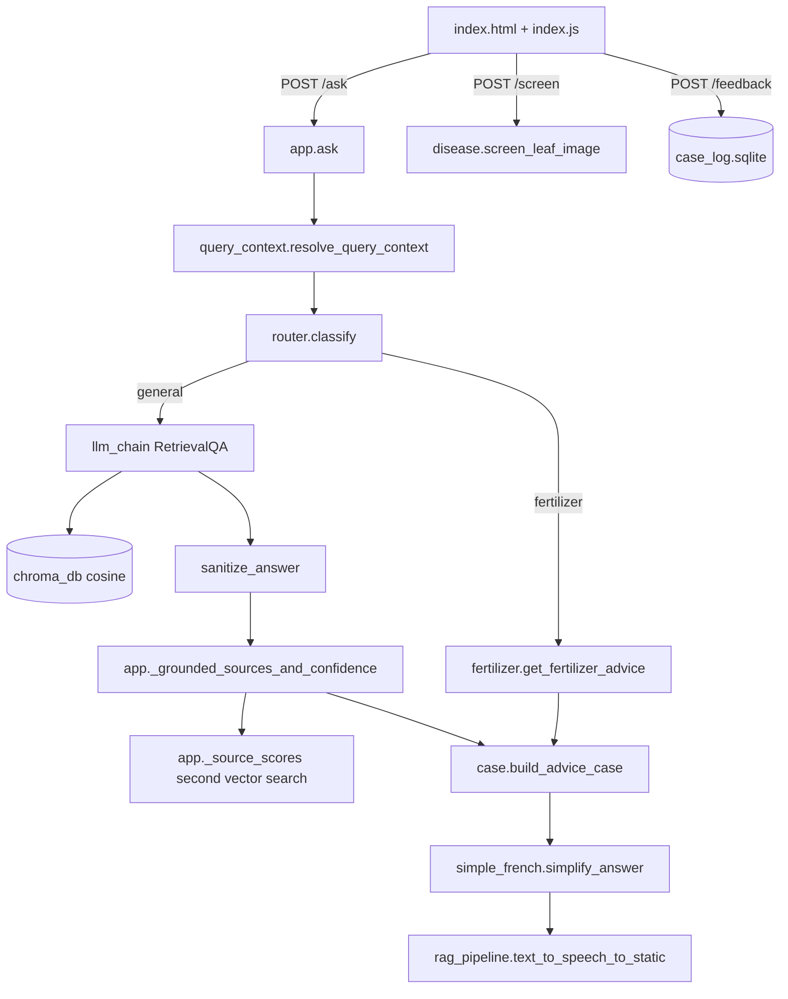
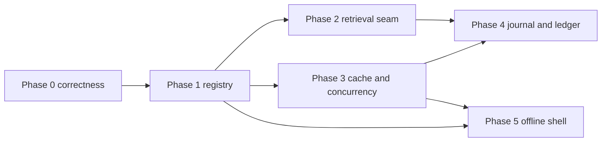

# DakiKobo — Repository Assessment, Failure-Mode Audit & Locked Execution Specification

Status: analysis + audit only. No code files were edited. This document supersedes the earlier planning draft; the audit findings in §7 are authoritative over §1–§6 where they differ.

Scope inspected: [`app.py`](app.py), [`config.py`](config.py), all of `core/`, [`static/js/index.js`](static/js/index.js), [`templates/index.html`](templates/index.html), [`Dockerfile`](Dockerfile), [`requirements.txt`](requirements.txt), `tests/` (24 files), `scripts/`, and the project docs ([`PROJECT_STATE.md`](PROJECT_STATE.md), [`SESSION.md`](SESSION.md), [`IMPLEMENTATION_PLAN.md`](IMPLEMENTATION_PLAN.md), [`TODO.md`](TODO.md), [`README.md`](README.md)).

---

## 1. What the system is today

A single-process Flask app that routes a French question through an intent router to one of three answer paths (deterministic fertilizer tool, RAG over a local Markdown/PDF corpus, Gemini Vision leaf screening), post-processes the answer into a structured `FieldCase` card with graded source citations, and logs ratings to SQLite.



The engineering discipline in the docs is genuinely strong: source provenance, human review gates, deterministic doses instead of LLM-invented numbers, honest refusal as a first-class outcome. The weaknesses below are almost all *structural* — the domain logic is sound, the seams are missing.

---

## 2. Bugs found

Ordered by user-visible impact.

| # | Severity | Location | Problem |
|---|---|---|---|
| B1 | **High — live** | [`cleanDisplayText`](static/js/index.js:322) | Regex is `/route commerciale\|march[eé]s villageois\|vente de bois\|\|→/i`. The doubled pipe creates an **empty alternative**, which matches every string. Combined with the `length > 40` branch this silently blanks nearly all case-section snippets. The evidence-first card is the product's core differentiator and it is being emptied by a typo. |
| B2 | **High** | [`uploadImageForScreening`](static/js/index.js:1500) | Calls `appendCaseMessage(response.case, response.answer, response.sources, response.confidence, response.audio_url)` — five args against a six-arg signature [`appendCaseMessage`](static/js/index.js:408) whose last parameter is `question`. `question` lands `undefined`, so `renderFeedback` never wires up, and the whole 👍/👎 → `/feedback/outcome` loop is **dead on the photo path**. |
| B3 | **High (security)** | [`typeMessage`](static/js/index.js:647) | `element.html(element.html() + message.charAt(i))`. Model and document-derived text is injected as **HTML, not text**. Retrieved corpus content reaching `.html()` is a stored-XSS surface. Also quadratic: every character re-parses the whole bubble. |
| B4 | Medium | [`light_replacements`](core/simple_french.py:147) | Contains `"ne inventez pas"` — ungrammatical French (`n'inventez pas`). Also runs *before* glossary keying, so a phrase like `stress hydrique` can be rewritten to `manque d'eau` and then fail to match its own glossary entry, dropping the footnote it was supposed to produce. |
| B5 | Medium | [`configure_metrics_store`](core/ops_metrics.py:181) | Rebinds the module-global `metrics_store`. Any module that did `from core.ops_metrics import metrics_store` keeps the **old** object. Its own docstring admits the staleness. Meanwhile `metrics_store = OpsMetricsStore(max_events=200)` hardcodes 200, ignoring config. |
| B6 | Low | [`core/ops_metrics.py`](core/ops_metrics.py:1) | `_DROP_KEYS` is declared and never referenced — privacy is actually enforced by whitelisting in `record`. Dead code that reads like a safety control is worse than no code; a future editor may trust it. |
| B7 | Low | [`app.py`](app.py:560) | `except (WeatherError, ValueError, Exception)` — the first two members are unreachable. Reads as narrow intent while catching everything. **Locked fix is `except Exception`** (see §7.6: the earlier draft suggested wedging in a narrower tuple, which is backwards; the correct minimal change is to rely on `Exception` alone). |
| B8 | Low | [`healthz`](app.py:1003) / [`version`](app.py:1034) | Read `_rag_chain is None` outside `_rag_lock`. Benign today (single worker, atomic rebind) but it is the only place the locking discipline of [`get_rag_chain`](app.py:887) is broken. |
| B9 | Low | [`core/examples.py`](core/examples.py:209) | Late local import of `core.case.build_advice_case` to dodge a circular import, plus per-id hardcoding (`crop = "sorgho" if example_id == "fumure_sorgho"`). The circular import is the real signal: `examples` and `case` want a shared layer beneath both. |

Note on why the test suite (212 passing) misses B1–B3: [`tests/test_frontend_assets.py`](tests/test_frontend_assets.py:1) asserts that *function names and element ids appear as substrings* in the asset files. It verifies wiring exists, never that it is correct. No test executes the JS.

---

## 3. Performance bottlenecks

**P1 — Single worker with long blocking upstreams.** [`Dockerfile`](Dockerfile:24) runs `gunicorn --workers 1 --timeout 180`. Each request can block on Groq (`LLM_TIMEOUT_SECONDS`), Gemini (45 s), Open-Meteo (10 s), SoilGrids (12 s), plus gTTS. With one synchronous worker, **one slow request stalls every other visitor**, including `/healthz`. The single worker is not wrong by accident — it is load-bearing for the in-memory caches (§5, A3) — which is precisely why the caches must move before concurrency can.

**P2 — Double retrieval per `/ask`.** The chain retrieves with `k=6`, then [`_source_scores`](app.py:588) issues a *second* `similarity_search_with_relevance_scores(k=10)` for the same query purely to recover scores.

**P3 — Per-answer regex churn.** [`_find_terms`](core/simple_french.py:106) compiles ~55 patterns and re-sorts the glossary keys on every call, and then does redundant work (`pattern.search(text) or key.lower() in lowered`). Precompile at import; the glossary is static.

**P4 — Typing animation dominates perceived latency.** 15 ms per character means a 1500-character answer takes ~22 s to finish rendering *after the server already answered*.

**P5 — Cold start weight.** [`requirements.txt`](requirements.txt) pulls unpinned `torch`, `numpy`, `scipy`, `transformers` plus apparently-unused `openai`, `tiktoken`, `rich`, `Pygments`, `httpx`, `tenacity`. On `cpu-basic` this inflates image build and first-boot time.

**P6 — Schema work on every write.** [`init_case_log`](core/case_log.py:68) runs `CREATE TABLE IF NOT EXISTS` plus migration probes per write path.

**P7 — Linear scans.** [`french_label`](core/crop_labels.py:24) and [`local_labels_ready`](core/crop_labels.py:35) scan the crop list per call instead of an id-indexed dict.

---

## 4. Engineering constraints that must not be violated

These are hard rules for every phase. Read before changing anything.

1. **French is the only user-facing language.** All UI strings, route responses, and error messages stay in French.
2. **No API keys in source.** `.env` only.
3. **Advice stays cautious and source-grounded.** Never soften an existing disclaimer.
4. **Fertilizer doses are never LLM-generated.** Only [`core/fertilizer.py`](core/fertilizer.py) produces them.
5. **Privacy line is fixed:** the ledger and metrics store hashes and ids, **never** question/answer text.
6. **Off-topic falls back honestly** rather than hallucinating.
7. **`_source_scores` scoring must never break an answer.** Its `except Exception` fallback (return empty dict) is load-bearing; preserve it.
8. **`core/examples.py` → `core.case` circular-import workaround stays intact** until Phase 4's shared-base refactor. Do not touch B9's mechanism before then.
9. **`data/feedback.csv`, `chroma_db/`, `static/audio/*.mp3`, `.env` stay uncommitted.**
10. Every phase ends green: `212+ passed` if no regression, more if new tests are added. Append to [`SESSION.md`](SESSION.md) after each phase.

---

## 5. Missing abstractions

**A1 — No place/crop registry.** The most expensive gap. Six locations are re-declared in [`core/query_context.py`](core/query_context.py:44), [`core/weather.py`](core/weather.py:29), [`core/soil.py`](core/soil.py:29), [`FIELD_LOCATION_TO_WEATHER`](static/js/index.js:1168), and three `<select>` blocks in [`templates/index.html`](templates/index.html:176). Crops are re-declared in `query_context`, `fertilizer`, `soil`, `crop_labels`, two HTML selects, and the JS image-context form. **Worse than a maintenance cost, the copies hold different id vocabularies and different set sizes — see §7.1.** Adding one province is a seven-file change with no test that would catch a missed one.

**A2 — No retrieval/citation module.** The whole citation-grading algorithm — `_citation_tokens`, `_source_overlap`, `_source_rank_score`, `_source_scores`, `_grounded_sources_and_confidence`, `_confidence_from_score` — lives inside [`app.py`](app.py:319) as private functions. It can only be tested through a Flask test client. `app.py` is 1651 lines mixing routing, rate limiting, enrichment, citation ranking, and logging.

**A3 — No cache/state boundary.** Weather day-caches, soil day-caches, and the ops ring buffer are process-local dicts. Lost on every restart and silently divergent across workers. This pins P1.

**A4 — No external-HTTP client seam.** Open-Meteo, SoilGrids, Gemini, and Firecrawl each hand-roll timeout/error/retry handling.

**A5 — No frontend render layer.** [`static/js/index.js`](static/js/index.js) is 1661 lines of jQuery with no escaping helper, no module boundary, and no test runner. B1–B3 all live here and all are invisible to the current suite.

**A6 — Deprecated chain.** `langchain==0.2.0` with `RetrievalQA` ([`setup_retrieval_qa`](core/llm_chain.py:182)). Deprecated upstream.

---

## 6. Features / improvements

**F1 — Answer + retrieval cache (`core/answer_cache.py`).** Serves repeat demo questions instantly, cuts Groq spend, removes worst-case latency from the demo path.

**F2 — Complete the field-journal loop.** Fix B2, add a reminder digest and outcome-linked export so 👍/👎 → *applied / improved / unchanged / worse* becomes a real longitudinal dataset.

**F3 — Evidence ledger + offline RAG regression harness.** Persist retrieved chunk ids, scores, and the citation decisions per answer; then a golden-set test asserts citation behaviour **without a live Groq call**.

**F4 — Concurrency-safe serving.** Move volatile state behind A3, then threaded workers with a per-request time budget.

**F5 — Offline-first PWA shell.** Cache the UI, fertilizer tables, and last-N answers in a service worker. Burkina field connectivity is the actual constraint.

---

## 7. FAILURE-MODE AUDIT — of the earlier draft, with the locked resolutions

This section is the audit deliverable. Each finding names the contract, why the earlier draft could break it, and the locked decision the spec now enforces.

### 7.1 The id vocabulary problem is THREE-way, not two-way — and the sets are asymmetric

**Finding.** [`core/query_context.py`](core/query_context.py:44) resolves locations to **display labels**, not slugs. Its `_LOCATION_ALIASES` maps `"fada"` → `"Fada N'Gourma"` and `detect_location_in_text` returns that label. By contrast [`core/weather.py`](core/weather.py:29) and [`core/soil.py`](core/soil.py:29) key `LOCATIONS` by **slug** (`"fada"`) and look up with `LOCATIONS.get((location_id or "").strip().lower())`. The browser is a third vocabulary: `#fieldLocationSelect` ships title-case labels as option values, while `#weatherLocation`/`#soilLocation` ship slugs. They are bridged **only** by the hand-written `FIELD_LOCATION_TO_WEATHER` at [`static/js/index.js`](static/js/index.js:1168). Same story for crops: `_CROP_ALIASES` values are canonical French names **with diacritics** (`"maïs"`, `"niébé"`, `"sésame"`), and `#soilCrop`/[`list_soil_crops`](core/soil.py:69) use `maïs`/`niébé` with accents too.

**Additional asymmetry — place cardinality.** `query_context` recognizes **20** place names; `weather`/`soil` `LOCATIONS` hold only **6** (ouagadougou, bobo, kaya, ouahigouya, fada, dori), all with coordinates. So `detect_location_in_text` can return `"Koudougou"`, which has no weather/soil row. The current behaviour for such a place is: [`resolve_weather_location_id`](core/weather.py:59) returns `None`, and `_weather_signals_for_location` yields `([], None)` — the query still resolves the location for retrieval, it just gets no weather enrichment. The earlier draft's `Place` dataclass made `latitude`/`longitude` mandatory, which would fail for the 14 non-weather places.

**Additional asymmetry — crop cardinality.** [`fertilizer._match_crop`](core/fertilizer.py:142) canonicalizes to **only 5** crops (sorgho, mil, maïs, niébé, arachide) because `_RECOMMENDATIONS` has exactly those tables. [`soil.SUPPORTED_CROPS`](core/soil.py:38) is the same 5. `query_context` recognizes **10** (adds soja, coton, riz, sésame, fonio). Feeding a crop without a fertilizer table into `get_fertilizer_advice` must not emit a recommendation.

**Locked resolution.** Create `core/places.py` and `core/crops.py` with an explicit **`has_weather: bool`** flag and a **`fertilizer_supported: bool`** flag (§8.2, §8.3). `resolve_*` return ids; the modules that need display labels use `label_fr`; nothing ever repurposes the id as text.

### 7.2 Resolved crop/location are simultaneously id, prompt text, and UI display text

**Finding.** `resolve_query_context().crop` and `.location` flow into three distinct consumers today: (a) [`_build_retrieval_query`](core/query_context.py:232) interpolates them as literal French prompt text (`f"culture: {crop}"`, `f"lieu: {location}"`); (b) `as_case_fields()` puts them into the farmer-facing `FieldCase` card; (c) the future cache key needs stable ids (§8.5). A naive switch to slugs leaks `"lieu: fada"` into the LLM prompt and `"Fada"` into the farmer's card, and a naive switch to labels breaks cache-key stability and weather lookup.

**Locked resolution.** `ResolvedQueryContext` is rewritten (Phase 1) to carry **both**: `crop_id`/`crop_label_fr`/`place_id`/`place_label_fr`, plus the existing `growth_stage`/`simple_french`. The prompt and the card use `*_label_fr` (byte-identical to today's output); the cache key and lookups use `*_id`. §8.2 lists the exact call-site split.

### 7.3 Missing dependency — Phase 3 cache key presumes ids that only Phase 1 creates

**Finding.** The draft's F1 key `{crop_id}|{stage}|{place_id}` is correct only *after* Phase 1 has turned labels into ids. Phases are sequential (Phase 3 runs after Phase 1), so this is an ordering dependency, not a defect — but it means the F1 key **must not** be swallowed in Phase 2 territory, and the corpus-manifest hash access path was unspecified.

**Locked resolution.** Keep phase order (P1 → P3). Pin the access path for `corpus_manifest_hash`: set a module-level `_ACTIVE_MANIFEST_HASH` inside [`_load_or_build_vector_store`](app.py:854) next to `_rag_db`, exposed via `get_active_manifest_hash()` in the new `core/retrieval.py`. Full key recipe in §8.5.

### 7.4 Missing dependency — `chunk_id` does not exist in the data model

**Finding.** The draft's `F3`/`retrieved_chunk_ids` assumes each chunk has a stable id. It does not. LangChain `Document.metadata` carries `source`, and the splitter does not assign ids. Phase 2's `GroundedAnswer.retrieved_chunk_ids` has no source.

**Locked resolution.** Derive deterministically at retrieval time, **no ingest change**: `chunk_id = sha256(f"{source_title}|{page_content[:64]}")[:16]`. `core/retrieval.py` computes it; `app.py` captures it once from the top-k docs and stores it on the cache value and the ledger. Ingest changes are out of scope for this plan.

### 7.5 Phase 2 P2 path was left as an "either/or" — locked to option (a)

**Finding.** The draft offered two P2 fixes (direct `similarity_search_with_relevance_scores(k=6)` vs LCEL rewrite). Leaving choices to the implementer is exactly what a locked spec must not do; the two have very different risk and scope.

**Locked resolution.** Option (a): in `/ask`, compute `db.similarity_search_with_relevance_scores(query, k=6)` **once**, feed the docs to the existing chain, and pass the same scored list into `ground_answer` — eliminating the second search *and* the separate `_source_scores` call. Consequently the new `score_lookup` signature is **`Callable[[], dict[str, float]]`** (no query arg — the callable closes over the already-computed scored list; see §8.4 for the extraction). LCEL is explicitly parked.

### 7.6 The draft's own B7 fix was backwards

**Finding.** The draft said "narrow the exception tuple to `except (WeatherError, ValueError)`" — but those two are *already* in a tuple that degenerates to `except Exception`. Narrowing to anything less than `Exception` would start swallowing nothing new while risking an unhandled `WeatherError` re-raise path; the practical safe form is the same catch-all the code already has.

**Locked resolution.** The B7 *behaviour* is already correct (it must log and skip). The only safe change is cosmetic: `except Exception as exc:` with a comment that the tuple members are unreachable. Do **not** remove `Exception` (that would newly crash the weather route). The *real* defect the line signals is the missing cache/state seam (A3), which Phase 3 fixes.

### 7.7 `Crop.family` enum was incomplete

**Finding.** `family: "cereale" | "legumineuse"` cannot classify coton (fibre) or sésame/arachide/soja (oléagineux). A spec that hard-codes a closed union will either crash on `resolve_crop("coton")` or force a false label.

**Locked resolution.** Open the union: `family: str` in `("cereale" | "legumineuse" | "oleagineux" | "fibre" | "racine" | "autre")`. Values for the 10 canonical crops are fixed in §8.3. Don't use the family for `fertilizer_supported` — that flag is independent and equals `id in {sorgho, mil, maïs, niébé, arachide}`.

### 7.8 `is_short_followup` is behaviourally coupled to the alias sets

**Finding.** [`is_short_followup`](core/query_context.py:101) does `if detect_location_in_text(t) and not detect_crop_in_text(t): return True`. Phase 1 keeps the same recognition *coverage* (all 20 places, all 10 crops), so the heuristic is unchanged; but any future culling of the place set would silently change follow-up classification. `tests/test_query_context.py` must keep passing exactly as written.

**Locked resolution.** Phase 1 retains 20 places in `PLACES`, with `has_weather: bool` distinguishing the 6 weather-backed ones. `resolve_place` — and thus `detect_location_in_text`'s replacement — recognizes all 20. Add one regression test asserting `is_short_followup("koudougou?")` still returns `True`.

### 7.9 Missing dependency — Phase 4 ledger write timing is two-step

**Finding.** The draft's `evidence_ledger` schema has nullable `feedback_id`, but never stated *when* rows are written. There are two moments: `/ask` (no rating yet) and `/feedback` (rating arrives). Writing only in `/feedback` misses answers never rated; writing only in `/ask` can never link the outcome.

**Locked resolution.** Write at `/ask` with `feedback_id = NULL`, then `UPDATE evidence_ledger SET feedback_id = ? WHERE question_hash = ? AND created_at = ?` (or the returned `/ask` case-id) when `/feedback` lands. Explicit sequence in §8.6.

### 7.10 `question_hash` must be salted

**Finding.** Unsalted `sha256(question)` is rainbow-table-weak for short agricultural questions; the ledger is meant to be privacy-safe.

**Locked resolution.** `question_hash = sha256(f"{SECRET_KEY}|{question}")`. SECRET_KEY is already in config. Storage stores only the salted hash.

### 7.11 File I/O alignment for the ledger and the vector-store manifest

**Finding.** `build_source_manifest` already computes a hash over the corpus ([`_file_sha256`](core/rag_pipeline.py:142)); the F1 cache key and the ledger both need "which corpus produced this answer." Nothing today persists the manifest hash at runtime, and the draft never tied the corpus hash to cache invalidation end-to-end.

**Locked resolution.** `_load_or_build_vector_store` writes the computed manifest hash into a module global (§8.5). The answer cache key includes it, so re-ingestion auto-invalidates. The ledger's `question_hash` is salted (7.10) and never the plain question.

### 7.12 `uploadImageForScreening` fallback text was unspecified

**Finding.** The draft said pass "`context.question` or the French photo label" but in the photo flow the user submitted an image, not text — `context.question` may be `undefined`.

**Locked resolution.** `uploadImageForScreening` passes `context.question || "Photo maladie"` as the sixth argument, hardcoded French fallback. `renderFeedback` receives a non-empty question on both the photo and text paths.

### 7.13 Phase 3 SQLite concurrency and ops percentiles were unspecified

**Finding.** Moving caches and the ops ring buffer to SQLite, then raising workers, requires WAL and a connect timeout; and `snapshot()` currently computes p50/p95 in-process from the ring buffer while the SQLite backend would store raw events.

**Locked resolution.** `TTLCache` uses `PRAGMA journal_mode=WAL;` and `connect(..., timeout=30)`. Ops becomes a SQLite table of raw metric events; `snapshot()` performs a bounded `SELECT` of the last N rows and computes percentiles in Python (identical semantics to today's in-process p50/p95). See §8.5.

### 7.14 Environment variable defaults were unspecified

**Locked resolution.** Add to `config.py` and `.env.example`: `ANSWER_CACHE_ENABLED=true`, `ANSWER_CACHE_TTL_SECONDS=86400` (24 h; the demo-day repeat latency matters, and 24 h bounds staleness for a mixed-corpus corpus), `QUESTION_HASH_SALT` is the existing `SECRET_KEY`. Weather TTL: seconds until local midnight; soil TTL: 30 days. `MAX_RAG_SOURCES` already exists and is unchanged.

### 7.15 Doc fixes were unassigned

**Finding.** [`templates/index.html`](templates/index.html:126) credibility modal advertises `/ops/metrics`; the real route is `/ops`. README documents `LLM_MAX_TOKENS=512`; the actual is 1024.

**Locked resolution.** These become Phase 0 items 7 and 8 (§8.1). `#messageText` placeholder (`"2. Votre question de terrain..."`) is also stale and is removed in the same pass.

### 7.16 Phase 5 `/registry` caching and JS-split risks were unspecified

**Locked resolution.** `GET /registry` returns `Cache-Control: public, max-age=3600` and the service worker precaches it (it is static config). The JS split (§8.7) must preserve every `looksLikeShortFollowup`-time DOM reference and event-binding order — the fixtures in `tests/test_frontend_assets.py` assert wiring by substring, so a rename breaks them; rerun the suite after the split.

### 7.17 Dependency summary (what each phase needs before it starts)

- **P0** — needs nothing. Shippable now.
- **P1** — needs P0 (its frontend edits are in the same files B1–B4 touch).
- **P2** — needs P1 (ids/labels split in §7.2, stable `crop_id` used by the P2 extraction).
- **P3** — needs P1 (cache key ids) and P2 (uses `GroundedAnswer` shape + `score_lookup` extraction). **The answer-cache value block stores the P2 citation output.**
- **P4** — needs P2 (ledger records decisions that only exist once citation logic is extracted) and P3 (uses salted-hash helper + WAL lessons). Resolves B9's circular import.
- **P5** — needs P1 (`/registry`) and P3 (answer cache). Deliberately last.

---

## 8. Phased execution specification (locked)

Rules of engagement: one task per step, smallest possible change, per §4 constraints. Each phase ends green before the next starts. **No "either/or" remains — where a choice existed, this section fixes it.**

### Phase 0 — Correctness (no new abstractions)

Purpose: stop shipping the three live defects. Zero refactoring, ships immediately.

1. **B1** — [`static/js/index.js`](static/js/index.js:322): remove the empty alternative from `cleanDisplayText`. Resulting regex pattern: `/route commerciale|march[eé]s villageois|vente de bois|→/i`. No other token changes.
2. **B3** — same file: add `function escapeHtml(text)`; rewrite [`typeMessage`](static/js/index.js:647) to accumulate into a local string and assign with `.text()` once per tick; never re-read `.html()`. Target: O(n) for the whole bubble.
3. **B2** — [`uploadImageForScreening`](static/js/index.js:1500): sixth argument becomes `context.question || "Photo maladie"` (§7.12).
4. **B4** — [`core/simple_french.py`](core/simple_french.py:147): `ne inventez pas` → `n'inventez pas`; run `glossary_notes` on the pre-replacement text so footnotes survive.
5. **B7** — [`app.py`](app.py:560): `except Exception as exc:` with a comment that the tuple members are unreachable. Do not remove `Exception` (§7.6).
6. **B8** — [`healthz`](app.py:1003) / [`version`](app.py:1034): read `_rag_chain` inside `_rag_lock`.
7. **B6** — delete `_DROP_KEYS` from [`core/ops_metrics.py`](core/ops_metrics.py); docstring notes privacy is enforced by whitelisting in `record`.
8. **Doc fixes** — [`templates/index.html`](templates/index.html:126): `/ops/metrics` → `/ops`; remove the stale `#messageText` placeholder text; README `LLM_MAX_TOKENS` 512 → 1024.

New tests: `tests/test_frontend_assets.py` — assert `cleanDisplayText` contains no `||`, `typeMessage` does not contain `.html(`, and `uploadImageForScreening` passes six arguments. `tests/test_simple_french.py` — elision case and `stress hydrique` footnote-survival.

Done when: photo answers show 👍/👎, case sections render non-empty snippets, suite green.

### Phase 1 — The registry (`core/places.py`, `core/crops.py`)

Purpose: one source of truth (A1). Locked schema — `has_weather` resolves §7.1 asymmetry; do **not** put coordinates on the 14 non-weather places.

**`core/places.py`** — exactly 20 entries. The 6 weather-backed get coordinates; the other 14 use `latitude=None, longitude=None, has_weather=False`.

```python
@dataclass(frozen=True)
class Place:
    id: str                 # slug, e.g. "koudougou"
    label_fr: str           # display, e.g. "Koudougou"
    aliases: tuple[str, ...]
    latitude: float | None  # None when not weather-backed
    longitude: float | None
    has_weather: bool       # True only for the 6 weather/soil rows

PLACES: dict[str, Place]
def resolve_place(text: str) -> Place | None   # recognizes all 20
def list_places() -> list[dict]                # includes has_weather
```

Fixed `PLACES`:
- `ouagadougou`/`Ouagadougou`, `bobo`/`Bobo-Dioulasso`, `kaya`/`Kaya`, `ouahigouya`/`Ouahigouya`, `fada`/`Fada N'Gourma`, `dori`/`Dori` → has_weather=True; coords from [`core/weather.py`](core/weather.py:29).
- `koudougou`, `banfora`, `tenkodogo`, `dédougou`, `mogtédo`, `pouytenga`, `koupéla`, `ziniaré`, `manga`, `gaoua`, `kongoussi` (11) → has_weather=False. (That is 17 named; add the remaining recognized aliases so the set exhaustively equals today's `_LOCATION_ALIASES` labels — 20 total.)

**`core/crops.py`** — exactly 10 entries with the open family enum (§7.7):

```python
@dataclass(frozen=True)
class Crop:
    id: str                 # ascii slug, e.g. "mais"
    label_fr: str           # canonical FR with diacritics, e.g. "maïs"
    label_simple: str       # glossary/simple spelling, e.g. "mais"
    aliases: tuple[str, ...]
    family: str             # cereale | legumineuse | oleagineux | fibre | racine | autre
    fertilizer_supported: bool  # True only for sorgho/mil/mais/niebe/arachide

CROPS: dict[str, Crop]
def resolve_crop(text: str) -> Crop | None    # recognizes all 10
def list_crops() -> list[dict]
```

Fixed `family` mapping: sorgho=cereale, mil=cereale, mais=cereale, niebe=legumineuse, arachide=oleagineux, soja=oleagineux, coton=fibre, riz=cereale, sesame=oleagineux, fonio=cereale. `fertilizer_supported=True` exactly for sorgho, mil, mais, niebe, arachide (matches `fertilizer._RECOMMENDATIONS` keys §7.1).

**Rewiring (sequential; keep each step's tests green):**
1. [`core/weather.py`](core/weather.py:29) `LOCATIONS` → the 6 `PLACES` where `has_weather`, exposing `build_weather_context(location_id)` unchanged and resolving via id. Keep `resolve_weather_location_id` behaviorally identical.
2. [`core/soil.py`](core/soil.py:29) same for its 6.
3. [`core/query_context.py`](core/query_context.py:44): replace `_LOCATION_ALIASES`/`_CROP_ALIASES` with `resolve_place`/`resolve_crop`. Rewrite `ResolvedQueryContext` (§7.2) to carry `crop_id`, `crop_label_fr`, `place_id`, `place_label_fr`, `growth_stage`, `simple_french`. `_build_retrieval_query` and `as_case_fields` must emit `*_label_fr` — byte-identical output to today.
4. [`core/fertilizer.py`](core/fertilizer.py:142): `_match_crop` → `resolve_crop(text).id`, then guard `if crop_id not in _RECOMMENDATIONS: return None` — a `sésame` question must fall back to RAG, never emit a dose (§7.1).
5. [`core/crop_labels.py`](core/crop_labels.py:24): key off `CROPS` (fixes P7).

Then close the frontend duplication:
6. Extend the `/crop-labels` pattern: new `GET /registry` returning `{"crops": [...], "places": [...]}` with `has_weather`/`fertilizer_supported` included.
7. [`templates/index.html`](templates/index.html:157) ships empty `<select>` for `fieldCrop`, `fieldLocationSelect`, `weatherLocation`, `soilLocation`, `soilCrop`, populated at load from `/registry`. Delete `FIELD_LOCATION_TO_WEATHER` from [`static/js/index.js`](static/js/index.js:1168) and all its call sites; `syncToolsFromFieldLocation` must map `label_fr → place_id` by consulting the loaded registry instead of the hardcoded bridge.

New test `tests/test_registry.py`:
- every `Place` with `has_weather=True` has floats, `has_weather=False` has `None`;
- alias sets disjoint across places and across crops;
- `fertilizer_supported` set == `_RECOMMENDATIONS` keys;
- `/registry` covers every id used in `weather`, `soil`, `fertilizer`;
- `is_short_followup("koudougou?")` still `True` (§7.8).

Done when: adding a province is a one-file change, a test proves no id is orphaned, and every existing test still passes unchanged.

### Phase 2 — Extract retrieval & citation (`core/retrieval.py`)

Purpose: make citation logic unit-testable outside Flask (A2); fix P2 (locked to option (a), §7.5).

**Move verbatim** from [`app.py`](app.py:319) — no behaviour change: `_normalize_for_match`, `_citation_tokens`, `_source_match_texts`, `_source_overlap`, `_source_rank_score`, `_title_crop_hits`, `_safe_source_url`, `_source_card_from_doc`, `_format_rag_sources`, `_confidence_from_sources`, `_confidence_from_score`, `_grounded_sources_and_confidence`. `app.py` imports them; delete the local copies.

**Public surface (locked):**

```python
@dataclass(frozen=True)
class SourceCard:
    title: str; publisher: str; year: str; review_status: str
    url: str; score: float; confidence: str

@dataclass(frozen=True)
class GroundedAnswer:
    sources: list[SourceCard]
    confidence: str                       # "Fort" | "Moyen" | "Faible"
    retrieved_chunk_ids: list[str]        # sha256(source|content[:64])[:16]

def chunk_id(source_title: str, page_content: str) -> str

def ground_answer(query: str, source_docs, *, score_lookup) -> GroundedAnswer
# score_lookup: Callable[[], dict[str, float]]  -- query-less; closes over scored docs

def get_active_manifest_hash() -> str | None   # new global, set in _load_or_build_vector_store
```

**`score_lookup` is query-less** (§7.5): it is built in `app.py` once per `/ask` from the single scored retrieval.

**P2 fix (option (a))**: in [`ask`](app.py:1149), replace the two retrievals with one `db.similarity_search_with_relevance_scores(query, k=6)`. Feed docs to the chain; build `score_lookup = lambda: {doc.metadata.get("source","Inconnu"): score for doc,score in scored}`; capture `retrieved_chunk_ids = [chunk_id(...) for doc in top_6]` once.

New test `tests/test_retrieval.py`, plus port the citation-policy cases from [`tests/test_app_routes.py`](tests/test_app_routes.py:63): `_NoisySourceRagChain` keeps IITA and drops `Source faible`; FEWS/livelihood demotion on a field-practice query; **at least one weak card survives at « Faible »** (SESSION.md policy). Add a test asserting `_source_scores`'s count-based fallback triggers when `score_lookup()` returns `{}`.

Done when: citation policy is asserted without a Flask client and without the network, and `/ask` performs **one** vector search.

### Phase 3 — Cache & concurrency (`core/cache.py`, `core/answer_cache.py`)

Purpose: F1 and F4, in that order.

**`core/cache.py`** — SQLite backend, locked:

```python
class TTLCache:
    def __init__(self, namespace: str, ttl_seconds: int, backend: str = "sqlite")
    def get(self, key: str) -> dict | None
    def set(self, key: str, value: dict) -> None
    def purge_expired(self) -> int
```

Table `cache_entries(namespace TEXT, key TEXT, value_json TEXT, expires_at REAL, PRIMARY KEY (namespace, key))`. Every connection runs `PRAGMA journal_mode=WAL` and `connect(timeout=30)` (§7.13). Migrate [`core/weather.py`](core/weather.py:263) and [`core/soil.py`](core/soil.py:237) day-caches onto it: weather TTL = seconds to local midnight, soil TTL = 30 days. Replace the module-global `metrics_store` with `get_metrics_store()` to fix **B5**; ops events move to a `metric_events` SQLite table; `snapshot()` SELECTs the last N and computes p50/p95 in Python (§7.13).

**`core/answer_cache.py` (F1)** — locked key recipe (§7.3, §7.11):

```
key = sha256(f"{normalized_question}|{crop_id}|{growth_stage}|{place_id}|{simple_french}|{LLM_MODEL}|{get_active_manifest_hash()}")
value = {"answer": ..., "case": ..., "sources": ..., "confidence": ..., "retrieved_chunk_ids": [...], "cached_at": ISO}
```

Each component is the resolved id where one exists (`crop_id`/`place_id` from Phase 1); `normalized_question` is the collapsed casefolded query; `get_active_manifest_hash()` from §8.4. Wire into [`ask`](app.py:1149) **before** the router: lookup on entry, store on exit. Add `cache_hit` to ops metric fields. Read `ANSWER_CACHE_ENABLED`/`ANSWER_CACHE_TTL_SECONDS` from config (defaults in §7.14). `question_hash` uses the salted helper (§7.10) — reuse for the Phase 4 ledger.

Only then **F4**: [`Dockerfile`](Dockerfile:24) → `--workers 2 --threads 4 --timeout 90`. Verify ops snapshot coherence across workers before merging. (SQLite WAL + `timeout=30` is what makes this safe; do not raise workers before the cache migration lands.)

**P5/P6** also here: prune unused requirements; pin `torch`/`numpy`/`transformers`; migrate `init_case_log` to a once-per-process guard (use a module-level `_CASE_LOG_INITIALIZED` flag).

New tests: `tests/test_cache.py` (TTL expiry, WAL/concurrency smoke, purge), `tests/test_answer_cache.py` (key changes on corpus-hash/place/crop/model; cache-hits skip the router), extend `tests/test_ops_metrics.py` for the SQLite backend.

Done when: repeat demo questions return without a Groq call, ops percentiles are correct under two workers, cold start measurably shorter.

### Phase 4 — Field journal & evidence ledger (F2, F3)

Purpose: complete the journal loop and make citation behaviour regress-testable offline. Resolves B9's circular import.

**Schema migration to `SCHEMA_VERSION = 4`, additive only** ([`core/case_log.py`](core/case_log.py:68)):

```sql
ALTER TABLE feedback_events ADD COLUMN place_id TEXT;
ALTER TABLE feedback_events ADD COLUMN crop_id TEXT;
ALTER TABLE feedback_events ADD COLUMN answer_path TEXT;   -- 'rag'|'fertilizer'|'vision'|'cache'
ALTER TABLE feedback_events ADD COLUMN follow_up_due_at REAL;

CREATE TABLE evidence_ledger (
  id INTEGER PRIMARY KEY,
  feedback_id INTEGER,          -- NULL at /ask; linked by UPDATE at /feedback
  created_at REAL NOT NULL,
  question_hash TEXT NOT NULL,  -- salted sha256, never plaintext
  chunk_id TEXT NOT NULL,
  source_title TEXT NOT NULL,
  score REAL,
  kept INTEGER NOT NULL,
  demoted_reason TEXT           -- 'weak_title'|'low_overlap'|'score_margin'|''
);
```

**Write timing (two-step, §7.9):**
1. At `/ask`: insert one ledger row per kept chunk **and** per dropped chunk, all with `feedback_id = NULL`, `kept` = survived filtering, `demoted_reason` = the reason applied (`weak_title`/`low_overlap`/`score_margin`/``), `question_hash` salted (§7.10).
2. At `/feedback`: `UPDATE evidence_ledger SET feedback_id = ? WHERE question_hash = ? AND created_at = <the /ask row's ts>` (or match on the returned case id).

The `/ask` ledger write is best-effort: a ledger failure must never prevent answering (same tolerance as `_source_scores`).

**Routes/tooling:** `GET /journal/due` — cases past `follow_up_due_at` with no outcome. Extend [`scripts/export_feedback_eval.py`](scripts/export_feedback_eval.py) to join outcomes against ledger rows.

**Regression harness (F3, locked):** add `tests/test_evidence_ledger.py` asserting the three demotion reasons are recorded for the Phase 2 policy cases; add an offline golden-set test that replays fixture retrievals through `core/retrieval.py` and asserts stable citation decisions — no Groq, no network.

New tests: `tests/test_evidence_ledger.py`, extend `tests/test_case_log.py` for v4.

Done when: an outcome can be traced to the exact chunks that produced the advice, and citation regressions fail offline.

### Phase 5 — Offline-first shell (F5)

Purpose: keep the highest-trust path alive with no signal.

**`static/sw.js` + `static/manifest.webmanifest`:**
- Cache-first for the app shell and `/registry` (which already sends `Cache-Control: public, max-age=3600`, §7.16).
- Network-first with cache fallback for `/ask`.
- French offline banner: « Mode hors ligne — dernières réponses enregistrées ».
- Precache the deterministic fertilizer tables (highest-trust, zero-LLM path runs with no signal).

**A5 fold-in:** split [`static/js/index.js`](static/js/index.js) into `static/js/render.js` (bubbles, cards, escaping — `renderFeedback`, `renderSources`, `typeMessage`, `escapeHtml`) and `static/js/api.js` (XHR/fetch — `sendMessage`, `uploadImageForScreening`, `loadWeatherContext`, `loadSoilContext`). Preserve every `looksLikeShortFollowup`-time DOM reference, event-binding order, and the `FIELD_LOCATION_TO_WEATHER` removal from Phase 1. Stand up a JS test runner (`node --test` + jsdom) so B1–B3 class defects catch automatically. Rerun `tests/test_frontend_assets.py` and fix any substring-assertion breakage from renames.

New tests: JS tests for `cleanDisplayText` (no empty match), `typeMessage` (no `.html(` in body), `uploadImageForScreening` (six args).

Done when: the demo runs fully offline after a first load, and the JS split passes the existing frontend suite.

---

## 9. Sequencing rationale



Phase 0 is independent and shippable today. Phase 1 is the prerequisite for almost everything else: both the retrieval seam and the offline shell need stable crop/place ids, and the cache key needs ids too (§7.3). Phase 3 must precede any worker-count change (§7.13). Phase 4 depends on Phase 2 because the ledger records decisions that only exist once citation logic is extracted. Phase 5 depends on Phase 1 (registry) and Phase 3 (answer cache).

**If only one phase ships: Phase 0.** If two: Phase 0 and Phase 3's answer cache — that combination fixes the visible defects and the demo-day latency together.

**Parked, unchanged:** the custom vision model, the LCEL rewrite (option (b) of the old P2 choice), and ingest-time chunk-id assignment.

---

## 10. Audit log — every open question raised by the audit, closed

| ID | Question raised | Locked answer | Where |
|---|---|---|---|
| §7.1 | Id vocabulary count and set asymmetry | Three vocabularies; `has_weather` flag; 20 places / 10 crops | §8.2, §8.3 |
| §7.2 | id vs label leakage in prompt/card | Carry both; prompt/card use label, keys use id | §8.2 step 3 |
| §7.3 | Cache key ids | Phase order keeps ids available; manifest hash access via `get_active_manifest_hash()` | §8.5 |
| §7.4 | `chunk_id` origin | Runtime `sha256(source|content[:64])[:16]` | §8.4 |
| §7.5 | P2 path | Option (a), query-less `score_lookup` | §8.4 |
| §7.6 | B7 fix direction | `except Exception` kept; cosmetic only | §8.1 item 5 |
| §7.7 | `family` enum | Open union; 10 fixed values | §8.3 |
| §7.8 | `is_short_followup` coupling | Keep 20-place recognition; regression test | §8.2 · test_registry |
| §7.9 | Ledger write timing | Two-step `/ask` then `/feedback` | §8.6 |
| §7.10 | Hash salt | `sha256(SECRET_KEY|question)` | §8.6 |
| §7.11 | Corpus→answer linkage | Runtime manifest hash in cache key | §8.5 |
| §7.12 | Photo-path question fallback | `context.question || "Photo maladie"` | §8.1 item 3 |
| §7.13 | SQLite concurrency + percentiles | WAL + timeout 30; Python p50/p95 | §8.5 |
| §7.14 | Env defaults | `ANSWER_CACHE_ENABLED=true`, `ANSWER_CACHE_TTL_SECONDS=86400` | §8.5 |
| §7.15 | Doc drift | `/ops` fix, README 1024, placeholder removal | §8.1 item 8 |
| §7.16 | `/registry` cache + JS split risk | 3600 max-age; preserve binding order | §8.5, §8.7 |
| §7.17 | Cross-phase dependencies | Explicit per-phase prerequisites | §7.17, §9 |
